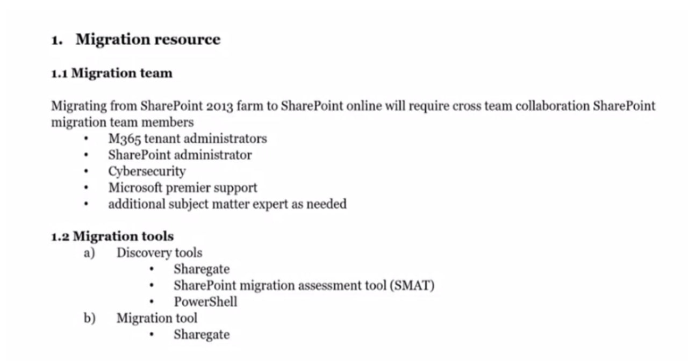
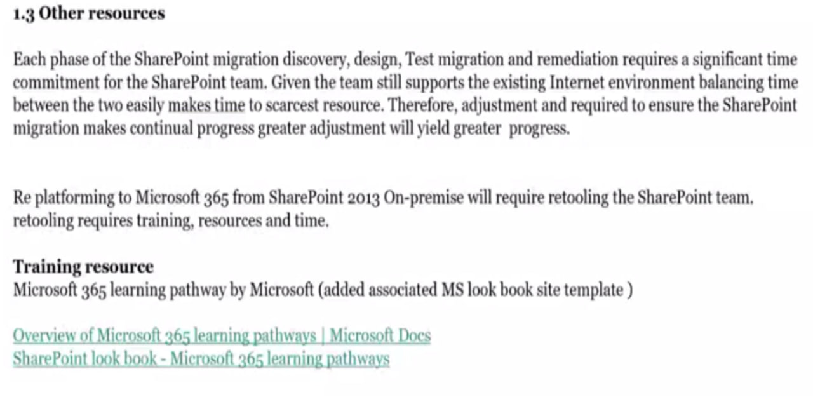
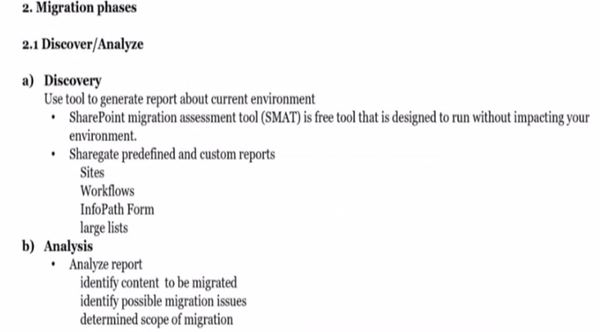
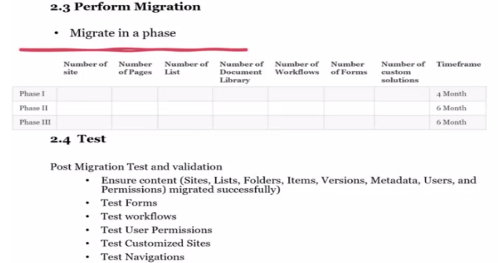
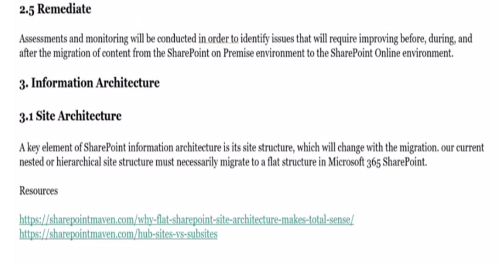

# -SharePoint-2019-to-SharePoint-Online-Migration-with-ALM

# SharePoint Online Migration Project — Impact Case Study

## Project Overview
This repository highlights my contributions to a large-scale SharePoint Online migration project. The migration aimed to modernize and optimize the organization's SharePoint environment while improving collaboration, governance, and content management.

**Project Highlights:**
- Original migration plan: **4 years**, double the proposed budget.
- Our proposed plan: **24 months**, **50% cost reduction**.
- Focused on process optimization, governance, and end-user adoption.

---

## My Contributions
- Contributed to **environment analysis and inventory**, identifying redundancies and optimization opportunities.
- Assisted in **developing the migration plan and timeline**, aligning with business priorities.
- Created **documentation and user guides** for staff adoption.
- Designed **PowerPoint slides and workflow diagrams** illustrating migration steps and strategy.
- Supported **governance and metadata standardization**, improving searchability and content organization.

---

## Key Impacts
- Reduced migration timeline from **4 years to 24 months**.
- Cut projected costs by **50%**.
- Streamlined SharePoint site structure, libraries, and lists.
- Improved efficiency and collaboration across teams.

---

## Skills Applied
- SharePoint Online (SPO)
- Power Platform (Power Apps, Power Automate)
- Microsoft 365 governance and ALM
- Migration planning and documentation
- Workflow design and user guides
- Stakeholder collaboration

---

## Screenshots and Documentation

**Migration Plan Overview:**  

**Sample User Guide:**  

### Migration Plan Overview

### Migration Plan Overview

### Migration Plan Overview

(Screenshots/photo_2026-01-05_15-31-18.jpg)
**Documentation Template:**  

> *Note: All screenshots have been redacted to remove confidential information.*

---

## Lessons Learned / Best Practices
- Conducting a detailed **environment inventory upfront** reduces unforeseen migration risks.
- Clear **governance policies** and **documentation** significantly improve adoption and reduce support issues.
- Collaborative planning with stakeholders ensures alignment with **business objectives** and **resource efficiency**.

---

## Repository Structure

